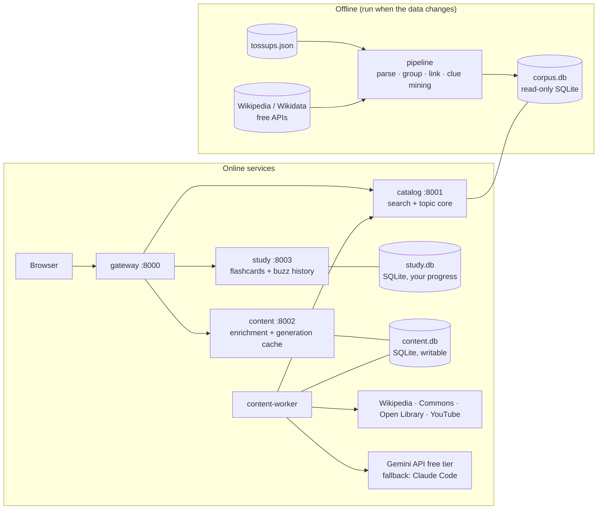
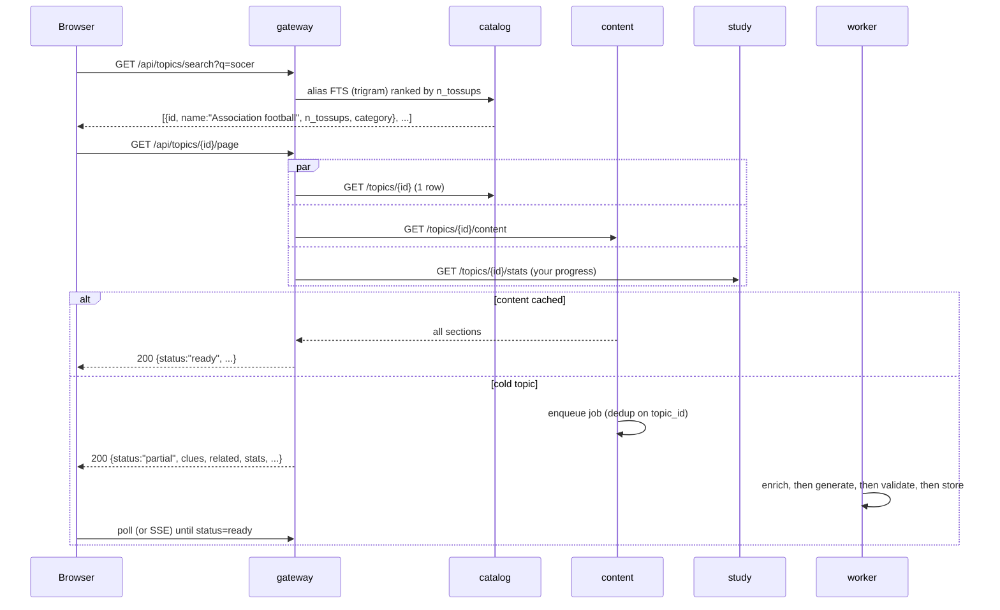

# Topic Explorer: Architecture & Build Plan

A user searches for a topic (e.g. "soccer"). The system finds every quiz bowl tossup whose answer is that topic, picks the clues most worth learning, and builds a study page around them: a layered summary, a narrative telling of the topic, a write-up for each key clue, a bibliography, educational videos, related topics, and a color theme chosen to suit the topic. Around the page sit study tools: buzzer practice on real tossups, spaced-repetition flashcards, a clue heatmap, a timeline and map, and a "don't confuse with" list.

**Two goals shape every decision below:**

1. **Lookups must be trivial.** All the hard work (parsing answers, grouping them into topics, extracting and ranking clues, linking related topics) happens once, offline, in a batch pipeline. At request time, the core page is a single primary-key read.
2. **$0 to run.** Every step that can be done without an LLM is done without one, using free data sources and local, open-source NLP. The LLM is used only for five writing and judgment tasks, each runs **once per topic**, and the result is cached permanently. Generation uses the **Gemini API free tier**, with Claude Code as a fallback (§7.3).

---

## 1. The input data (what `tossups.json` actually is)

Measured on the file currently in the repo root:

| Fact | Value | Design consequence |
|---|---|---|
| Format | 404 MB **NDJSON** MongoDB export (one object per line, `$numberInt`/`$oid`/`$date` wrappers) | Stream it; never `json.load` it whole. Unwrap extended JSON on ingest. |
| Tossups | 187,165, from 701 sets, 2000–2026 | Small enough for SQLite on a laptop. |
| Exact duplicate question texts | 659 | Dedupe by hash of the normalized text before counting clue frequency. |
| Answers with `<u>` markup (required part) | 183,693 (98%) | The underlined text is a reliable signal for the canonical name and short aliases. |
| Answers with `[...]` alternates | 91,765 | Parse `or`/`accept`/`prompt on`/`do not accept` directives. |
| Questions with a power mark `(*)` | 115,250 (62%) | Gives a free "is this clue early?" signal on top of position. |
| Empty answers | ~875 | Drop them. |
| Trailing author tags like `<AP>` | ~890 | Strip them. |
| Distinct naive main answers | 60,185 | Shrinks after grouping (plurals, articles, aliases). |
| …with ≥3 / ≥10 / ≥50 tossups | 13,715 / 3,670 / 249 | These tiers decide which topics get pages and which are pre-generated. |
| Median question length | 121 words, ~5 sentences | About 940k candidate clues in total. |

The answer lines are messy but follow a convention. Real examples:

```
doctors [or physicians]
soccer [or association football; accept football or balɔntan or ntolatan or futbol ...]
football [accept calcio fiorentino before mention, and, if necessary, soccer] <AP>
England national soccer team [prompt on The Three Lions; do not accept or prompt on "United ...]
```

They also show why "find all questions where the answer is soccer" needs care. A plain text search for "soccer" in answer lines matches 70 different answer lines, including FIFA, the World Cup, stadiums, and the Tham Luang cave rescue. Those aren't questions *about* soccer; they're **related topics**.

> ⚠️ `tossups.json` is untracked and 404 MB, which is over GitHub's 100 MB per-file limit. Move it to `data/raw/` and gitignore `data/` before the next commit (§10, step 1).

---

## 2. System overview



| Component | Replaces | Owns | Calls out to | Costs money? |
|---|---|---|---|---|
| `pipeline/` (batch CLI, not a server) | — | Builds `corpus.db` | Wikipedia/Wikidata (free) | No |
| `catalog` service | `service-a` | `corpus.db` (read-only) | Nothing | No |
| `content` service (API) | `service-b` | `content.db` (cache + job queue) | Nothing on the request path | No |
| `content-worker` (runs on your Mac while the Claude Code fallback is enabled, see §7.3) | — | Writes `content.db` | Free APIs + Gemini (+ Claude Code fallback) | No |
| `study` service | — (new) | `study.db`: your cards, review schedule and buzz history | Nothing | No |
| `gateway` | (existing) | Nothing | catalog, content, study | No |

**Why this split:**
- `catalog` is pure, fast and immutable. It ships with its database file and has no outbound dependencies, so it can never be slowed down or broken by Wikipedia, YouTube or the LLM.
- `content` holds everything fetched or generated, which is slow, can fail, and in one case costs money. A worker processes jobs so no user request ever waits on an LLM call while holding a connection.
- `study` holds the only data that can't be rebuilt: your progress. Keeping it apart from the regenerable caches makes it simple to back up (one file) and safe from pipeline rebuilds.
- Four small services plus a worker is about the right size for a one-person project. Splitting enrichment, generation and theming into separate services would add deployment overhead without isolating anything useful.

**Why SQLite (for now):** The corpus is read-only and built offline, so a SQLite file is the simplest and cheapest store possible, with zero hosting cost, and it can be baked into the catalog image. `content.db` has one writer (the worker) and runs on one host, so SQLite in WAL mode is enough. Move `content.db` to Postgres only when you run more than one host. Back up `study.db` nightly with SQLite's online backup (`sqlite3 study.db ".backup ..."`) to a synced folder; nothing else needs backing up because it can all be rebuilt.

---

## 3. Offline pipeline (the important part)

A workspace package `pipeline/` (`hortum-pipeline`) exposes a CLI with one command per stage. Each stage reads the previous stage's output, is **idempotent**, and stamps its output with a `PIPELINE_VERSION` so downstream caches know when to invalidate.

```
make pipeline         # runs all stages
hortum-pipeline ingest | parse-answers | group | link | facts | clues | cluster | score | relate | confuse | snapshot
```

Everything here is free: Python, `selectolax` (HTML), `unidecode`, `inflect` (singularizing), spaCy `en_core_web_sm` (noun phrases and named entities), `sentence-transformers` `all-MiniLM-L6-v2` (local, CPU), `scikit-learn`, `pyahocorasick`, and the Wikipedia/Wikidata public APIs with an on-disk HTTP cache. I expect a full run to take a few hours on a laptop, mostly in the network-bound linking stage, which is cached so re-runs are fast.

### Stage 1: `ingest`
- Stream NDJSON, unwrap extended JSON, drop empty answers, strip author tags.
- Dedupe by `sha1(normalized question text)`, keeping the copy with the most metadata. Record duplicates in `tossup_aliases` so nothing is lost.
- Load into `tossups` and `sets`.

### Stage 2: `parse-answers` → structured answer lines
Parse the **HTML** answer (not the sanitized one) so underline and bold information is preserved. For each tossup, produce:

```json
{
  "main": "doctors",
  "required": ["doctor"],
  "accept": ["physicians"],
  "accept_conditional": [{"text": "soccer", "condition": "if necessary"}],
  "prompt": ["World Cup"],
  "reject": ["United Kingdom"],
  "parse_confidence": 0.95
}
```

- A small hand-written tokenizer for `[...]` / `(...)` blocks that splits on `;` and recognizes the directives `or`, `accept`, `prompt on`, `anti-prompt on`, `do not accept`/`reject`, and conditions (`before "X"`, `until mentioned`, `if necessary`).
- `required` comes from the underlined spans, which is how "Martin Arrowsmith" also yields the alias "Arrowsmith".
- Anything unparseable gets low confidence and is kept. Report a coverage percentage per run and iterate on the parser against the worst cases.

### Stage 3: `group` → candidate topics
Normalize the main answer (casefold, `unidecode`, strip leading articles and punctuation, singularize), then group **only on the normalized main answer within a compatible category**.

> **Never merge groups because they share an `accept` alias.** Accept chains over-merge: "football" is accepted for both soccer and American football answers, and following that chain would fuse them into one topic. Accept and prompt strings become **aliases** of a topic, never merge keys.

The same main string in very different categories (e.g. "Mercury" in Science/Astronomy, Science/Chemistry and Mythology) starts as separate candidates, and Stage 4 settles them.

### Stage 4: `link` → canonical topics via Wikidata
This is the step that makes grouping actually work, and it's free:
1. For each candidate group, query Wikipedia search (`action=query&list=search`) with the main answer plus a category hint.
2. Score each of the top ~5 results by TF-IDF cosine between the group's combined question text and the article's lead. Questions about the planet Mercury overlap heavily with the planet's article and very little with the god's.
3. Accept the best match above a threshold, and record its **Wikidata QID** and Wikipedia title.
4. **Candidate groups that resolve to the same QID merge into one topic.** This is where "soccer" and "association football" come together correctly.
5. Answer forms (main, underlined parts, accepted alternates) and the Wikipedia title go into `topic_aliases`, so a search for "futbol" or "association football" finds the topic. Stage 4b adds Wikidata's aliases.

Unlinked groups (common for categories like "doctors" or "stadiums") stay as topics with a local ID (`local:<slug>`); unlinked groups with the same normalized answer merge. They still work; they just get thinner enrichment. Wikimedia **refuses** requests whose `User-Agent` lacks contact details (a URL or email), so `link` and `facts` won't start until `PIPELINE_WIKIMEDIA_USER_AGENT` has one. Requests are serial and cached on disk, and `--max-requests N` caps new requests per run (cached ones are free), so a long first run can be split across sessions.

### Stage 4b: `facts` → dates and places from Wikidata
For every topic with a QID, fetch its Wikidata entity in bulk (`wbgetentities`, 50 IDs per request, so ~800 requests for the whole corpus, cached on disk) and keep:
- **Dates:** point in time (P585), start/end time (P580/P582), inception/dissolved (P571/P576), birth/death (P569/P570), publication date (P577). Keep Wikidata's **precision** (day, year, decade, century), so "c. 1300" isn't drawn as 1 January 1300, and handle BCE dates.
- **Places:** coordinates (P625), or, if the topic isn't itself a place, the coordinates of its location (P276), birthplace/deathplace (P19/P20) or country (P17), resolved in a second bulk pass.
- The Wikidata one-line **description**, used as a hover label everywhere a topic is mentioned.

### Stage 5: `clues` → split questions into clues
Also record each tossup's `power_word_index` (the word where `(*)` falls), then remove the marker from the text. Use a quiz-aware sentence splitter that handles `St.`, `U.S.`, initials, quoted titles and the `(*)` marker. Sentences with semicolons that run past ~40 words are split again. For every clue, store:

| Field | Meaning |
|---|---|
| `char_start`, `char_end`, `word_start`, `word_end` | Exact span in the question, so buzzer practice can map "you buzzed at word 37" to the clue being read |
| `position` | `char_start / len(question)`; 0 is the lead-in, 1 is the end |
| `in_power` | Appears before `(*)` |
| `is_giveaway` | The final "For 10 points, name this…" sentence |
| `key_terms` | Named entities, quoted titles and capitalized noun phrases from spaCy, e.g. `Max Gottlieb`, `McGurk Institute`, `Leora Tozer` |

### Stage 6: `cluster` → the same fact, worded differently
Different questions phrase one fact many ways ("invited to the McGurk Institute by Max Gottlieb" vs. "his mentor Gottlieb brings him to McGurk"). Within each topic:
- Embed clues with MiniLM (local, free), and boost similarity when clues share key terms.
- Run agglomerative clustering with a cosine threshold (tune it, starting around 0.6).
- The **representative** clue is the medoid, and the cluster's **label** is its most frequent key term.

### Stage 7: `score` → "high-impact" clues
The goal is clues **common enough to be worth knowing** and **early enough to win the buzz**. For each clue cluster:

```
frequency    F = log(1 + distinct_sets)              # common across the circuit, not repeated in one set
earliness    E = 1 - median(position)                # earlier is better
             E += 0.15 * share_in_power              # bonus for appearing before (*)
specificity  S = idf(key_terms across all topics)    # "pointing power": rare elsewhere, so it identifies THIS topic
impact       = F * E * sqrt(S)
```

- **Filters:** at least 2 distinct sets (relaxed to 1 for topics with fewer than 6 tossups), exclude clusters that are only giveaways, and exclude clusters whose key terms are just the answer's own aliases.
- **Selection:** take the top K by maximal marginal relevance (MMR) so the 5–10 clues aren't near-duplicates. K = `clamp(5, 10, clusters passing the filters)`.
- **Heatmap statistics** (stored on each cluster for §8.3): a 10-bin histogram of positions, share in power, counts per difficulty band (middle school 1, high school 2–5, college 6–9, open 10), first and last year seen, and a trend label (`rising`, `steady`, `fading`) from a linear fit of appearances per year.
- **Tuning:** hand-label "good clues" for ~30 topics across categories and difficulties, then tune the weights and thresholds against them. Keep that file in `pipeline/eval/`. It's the only way to know whether a weight change helped.

### Stage 8: `relate` → related topics
"Clues that are answers to their own questions":
- Build an Aho-Corasick automaton over every topic alias (dropping aliases shorter than 4 characters, aliases shared by several topics, and stop-like aliases such as "water").
- Scan every clue. Each hit is a directed edge `topic A's clue mentions topic B`.
- Score edges by `log(1 + mentions) * log(1 + B's tossup count)`, merge in reverse edges at a lower weight, and keep the top ~12. Store **which clue** created each edge, so the page can say *why* two topics are related.

This is also how soccer's page links to FIFA, the World Cup, Pelé and so on.

### Stage 9: `confuse` → "don't confuse with"
Collect candidate pairs from four free signals, score them, and keep the top 5 per topic, each with its evidence:

| Signal | How | Example |
|---|---|---|
| **Answer-line rejects and prompts** | Run the alias automaton over `reject` and `prompt` strings from Stage 2; a hit on another topic is a confusion edge | `do not accept "United Kingdom"` on an England question |
| **Same name** | Topics that share a normalized alias but resolved to different QIDs | Mercury (planet / element / god) |
| **Clue overlap** | Cosine similarity between topics' clue-embedding centroids within a category, above a threshold, excluding pairs that are already "related" | Two novels by the same author with overlapping character clues |
| **Look-alike names** | Edit distance between aliases within a category | Similar surnames among composers |

### Stage 10: `snapshot` → one row per topic
Denormalize everything the page needs from the corpus into `topic_snapshots(topic_id, json, pipeline_version)`. **The catalog's topic endpoint is a single primary-key read with no joins.**

---

## 4. Data model

### `corpus.db` (built by the pipeline, read-only, owned by catalog)

```sql
sets(id, name, year, is_standard)
tossups(id, text_hash, set_id, packet_name, packet_number, number, category, subcategory,
        alt_subcategory, difficulty, question_text, question_html, answer_text, answer_html,
        n_reports, power_word_index)
tossup_duplicates(tossup_id, kept_id)
answer_parses(tossup_id, line_key, main, main_norm, parser_main, required JSON, accept JSON,
              prompt JSON, reject JSON, notes JSON, issues JSON, parser_confidence, confidence,
              source /* parser|override|excluded */, parser_version)
candidate_groups(id, norm_key, category, subcategory, display_name, n_tossups, n_sets)
tossup_groups(tossup_id, group_id)
group_links(group_id, status /* linked|no_match|skipped */, qid, title, score, similarity, candidates JSON)
tossup_topics(tossup_id, topic_id)
topics(id, slug, display_name, wikidata_qid, wikipedia_title, description, primary_category,
       n_tossups, n_sets, difficulty_min, difficulty_max, first_year, last_year)
topic_aliases(topic_id, alias, alias_search, source /* main|required|accept|title|wikidata */, weight)
topic_aliases_fts  -- FTS5, tokenize='trigram' over alias_search: typo-tolerant search
clues(id, tossup_id, topic_id, ordinal, text, char_start, char_end, word_start, word_end,
      position, in_power, is_giveaway, key_terms JSON, cluster_id)
clue_clusters(id, topic_id, label, key_terms JSON, representative_clue_id,
              n_tossups, n_sets, median_position, share_in_power, specificity, impact, rank /* NULL if not top-K */,
              position_hist JSON, difficulty_hist JSON, first_year, last_year, trend)
topic_links(src_topic_id, dst_topic_id, score, n_mentions, example_clue_id)
topic_facts(topic_id, kind /* date|place|description */, property, value JSON /* time+precision | lat,lon,label | text */)
confusions(topic_id, other_topic_id, reason /* reject|prompt|same_name|clue_overlap|lookalike */, score, evidence JSON)
topic_snapshots(topic_id PRIMARY KEY, json, pipeline_version)
```

### `content.db` (writable, owned by content)

```sql
enrichments(topic_id, kind /* wiki|images|books|videos */, payload JSON,
            source_version, fetched_at, PRIMARY KEY (topic_id, kind))
generations(topic_id, kind /* summary|clue_narratives|theme|book_blurbs */,
            model, prompt_version, input_hash, payload JSON,
            input_tokens, output_tokens, cost_usd, created_at,
            PRIMARY KEY (topic_id, kind))
jobs(id, topic_id, kind, status /* queued|running|done|failed */, priority,
     attempts, last_error, not_before, created_at, updated_at)
spend(day PRIMARY KEY, usd)
```

A generation is reused as long as `(prompt_version, input_hash)` hasn't changed. Bumping a prompt version regenerates lazily, not all at once.

### `study.db` (writable, owned by study; back this one up)

```sql
followed_topics(topic_id PRIMARY KEY, added_at)
cards(card_id PRIMARY KEY /* stable hash, see §8.2 */, topic_id, kind /* clue|reverse|missed */,
      front, back, source_ref JSON, created_at, suspended)
card_state(card_id PRIMARY KEY, due, stability, difficulty, reps, lapses, state, last_review)
reviews(id, card_id, rating /* 1 again | 2 hard | 3 good | 4 easy */, reviewed_at, elapsed_days)
buzzes(id, tossup_id, topic_id, word_index, position, clue_cluster_id, result /* correct|incorrect|no_buzz */,
       in_power, answer_given, judged_by /* auto|self */, created_at)
```

Cards store their own `front` and `back` text, so a pipeline rebuild that changes clue IDs never breaks your deck.

---

## 5. Request flow (the "easy lookup")



- **Search:** FTS5 trigram over aliases gives typo tolerance ("socer"), prefix matching and alias hits ("futbol"). Rank by match quality × `log(n_tossups)`. Ambiguous names return several topics, labeled by category (Mercury the planet, Mercury the element, Mercury the god).
- **Cold topics** still render immediately with everything that's precomputed: impact clues (raw clue text), heatmap, related topics, confusions, timeline, map, stats, and buzzer practice. The written sections fill in when the worker finishes, typically within a minute.
- The gateway composes the page (backend-for-frontend), so the browser makes one call.

### Page contract (abridged)

```json
{
  "status": "ready",
  "topic": {"id": "Q…(Wikidata QID)", "name": "Association football", "aliases": ["soccer", "football", "futbol"],
            "stats": {"n_tossups": 41, "n_sets": 37, "difficulty": [2, 9], "years": [2004, 2025]}},
  "story": {"form": "eyewitness_scene", "markdown": "...", "clues_used": ["..."]},
  "summary": {"tiers": [{"level": "middle_school", "markdown": "..."}, {"level": "high_school"},
                        {"level": "undergraduate"}, {"level": "graduate"}],
              "source": {"title": "Association football", "license": "CC BY-SA 4.0", "url": "..."}},
  "clues": [{"rank": 1, "label": "Calcio fiorentino", "impact": 0.83, "median_position": 0.18,
             "examples": ["...", "..."], "narrative": "...",
             "heatmap": {"position_hist": [0, 3, 5, 2, 1, 0, 0, 0, 0, 0], "in_power": 0.9,
                         "difficulty": {"hs": 4, "college": 7, "open": 0}, "years": [2009, 2024], "trend": "steady"}}],
  "confusions": [{"id": "Q…", "name": "American football", "reason": "same_name",
                  "distinguishing_clues": {"this": ["..."], "other": ["..."]}, "tip": "..."}],
  "timeline": [{"id": "Q…", "label": "...", "start": {"time": "1863", "precision": "year"}, "end": null, "is_topic": true}],
  "map": [{"id": "Q…", "label": "...", "lat": 51.5, "lon": -0.12, "role": "topic|related|clue_place"}],
  "practice": {"n_tossups": 41, "your_stats": {"buzzes": 12, "accuracy": 0.75, "median_buzz_position": 0.61}},
  "bibliography": {"highlighted": [{"title": "...", "author": "...", "year": 2006, "level": "intro",
                                    "blurb": "...", "cover": "https://covers.openlibrary.org/..."}],
                   "more": [...], "wikipedia": {...}},
  "videos": [{"youtube_id": "...", "title": "...", "channel": "CrashCourse", "duration_s": 642}],
  "related": [{"id": "Q…", "name": "FIFA World Cup", "why": "mentioned in 9 clues"}],
  "theme": {"light": {"bg": "#...", "surface": "#...", "text": "#...", "accent": "#...", "accent2": "#...", "muted": "#..."},
            "dark": {...}, "font_pairing": "classical-serif", "hero_image": {...}}
}
```

---

## 6. Enrichment (free data sources, no LLM)

The worker fetches these and caches them in `enrichments`. Wikimedia and Open Library both ask for a descriptive `User-Agent`.

| Section | Source (all free) | What we take |
|---|---|---|
| **Wikipedia article** | `action=query&prop=extracts&explaintext` + `action=parse` (sections) | Plain text of the lead and main sections, capped at ~6k tokens, used as grounding for the summary. |
| **Images** | `prop=pageimages`, `prop=images` + `imageinfo&iiprop=url\|extmetadata`, Wikidata `P18` | Up to ~10 candidates with caption, dimensions and **license/attribution**. |
| **Bibliography candidates** | (1) The article's *Further reading*, *Bibliography* and *Sources* sections plus `{{cite book}}` templates (title, author, year, ISBN, how often cited). (2) Open Library `search.json` (subject and title search: `edition_count`, `ratings_count`, `want_to_read_count`, `cover_i`). | Merge and dedupe by ISBN or work key, then rank by `cited_in_article×3 + log(edition_count) + log(1+ratings_count)` and keep the top ~15. Add category-specific free references: Stanford Encyclopedia of Philosophy for philosophy, MacTutor for mathematicians, Britannica for everything. |
| **Videos** | YouTube Data API v3 (free key; default quota **10,000 units/day**, `search.list` = 100 units, `videos.list` = 1) | See below. |
| **Clue grounding** | Wikipedia lead (~150 tokens) for each impact clue whose key term links to a topic or article | Gives the clue narratives facts to work from instead of guesses. |

**Videos, specifically.** No LLM is needed, and they're ranked deterministically:
1. Run `search.list(q="<topic name> <disambiguator>", type=video, videoEmbeddable=true, maxResults=50)` and keep results from an **allowlist of educational channel IDs** (CrashCourse, Khan Academy, TED-Ed, PBS Eons/Space Time, Kurzgesagt, Smithsonian, Great Courses, SciShow, Overly Sarcastic Productions, Kings and Generals, and so on). The list lives in config.
2. If fewer than 2 results survive, run a second search restricted to `videoCategoryId=27` (Education).
3. Fetch `videos.list` for duration and views (1 unit). Keep 4–40 minute videos and rank by allowlist priority, then title match, then views. Take 2–3.

The quota allows ~50–100 new topics a day, which is plenty for one user. Cache results permanently and show a "videos coming soon" state if the quota ever runs out.

---

## 7. Generation (the only part that uses an LLM)

### 7.1 The five LLM tasks

| Task | Input (grounding) | Output | Guardrails |
|---|---|---|---|
| **Layered summary** (500–1000 words) | Wikipedia extract | 4 tiers: middle school, high school, undergraduate, graduate/PhD, each building on the last | Word count checked; "use only facts supported by the source, or widely established"; attribution line (CC BY-SA). |
| **The story** (600–900 words) | Same Wikipedia extract, plus the labels and representative text of the top 3–5 impact clues | A narrative telling of the topic, in a form chosen to suit it (see below) | Must work in every listed clue (checked in code by label match); labeled "dramatized" on the page; invented details limited to atmosphere, never facts. |
| **Clue narratives** (200–500 words each) | Each clue's representative text plus 2–3 variant phrasings, the clue's Wikipedia lead, and the topic name | What the clue refers to, how it connects to the topic, how question writers phrase it, and what to listen for | Per-narrative word count; one narrative per clue ID (validated against the input list). |
| **Theme** (palette, font, photo) | Topic name, category, summary lead, image candidates (captions plus a palette extracted from each image) | Hex colors for 6 tokens, light and dark; one of ~8 **predefined** font pairings; hero image chosen **from the candidates** | Hex format; **WCAG AA contrast enforced in code** (lightness auto-adjusted in OKLCH, not left to the model); dark mode derived and checked. |
| **Book highlights** | The ~15 ranked candidates with Open Library metadata | 3–5 candidate **IDs** with blurbs (40–80 words) and a level (intro, intermediate, scholarly) | IDs must be a subset of the input, so **the model can't invent books**. |

Notes:
- **The story complements the summary.** The summary explains; the story makes the topic memorable, and because it has to include the top clues, it also works as a memory aid for them. The model picks a form from a short list keyed to the category, so the variety is controlled:
  - *History, Religion, Current Events:* a scene at a pivotal moment, told by someone who was there.
  - *Literature, Mythology:* a reader's journey through the work or myth, meeting its key figures in order.
  - *Science, Social Science, Philosophy:* the story of how the idea was discovered or argued for, or a journey through the system itself (e.g. following a molecule through a reaction).
  - *Fine Arts:* walking through the painting, building or performance, noticing what a question writer would.
  - *Geography:* a traveller's route through the place.
- **Palette extraction is free.** Run k-means in OKLCH on each candidate image thumbnail. The model then chooses and adjusts from real colors plus what it knows about the topic, rather than inventing them. That gets you polar blues and greys or Aztec jade, red and ochre for very little output. The page **layout never changes**: the theme only fills CSS variables (`--bg`, `--surface`, `--text`, `--accent`, `--accent-2`, `--muted`) and picks a font pairing.
- **Photos:** the model selects by caption and metadata (text only). Sending images to a vision model would let it judge composition but would use more of the free quota. Start text-only.
- **No hallucinated sources:** books, images and videos are always picked from candidates that came from real APIs. The model only chooses among them and writes about them.

### 7.2 Two requests per topic, structured output

| Request | Tasks | Model tier | Output |
|---|---|---|---|
| **Writing** | Summary, story, clue narratives | The best Gemini model with a free tier (a Pro model if one is available free) | ~7k tokens |
| **Light** | Theme, book highlights, one-line "how to tell them apart" tips for confusions | A Flash or Flash-Lite model (much higher free limits) | ~1.2k tokens |

Each request returns JSON matching a schema (Gemini's JSON-schema response mode, or the schema in the prompt for the Claude Code fallback). Validate the output in code (word counts, clue coverage, ID subsets, contrast, hex format). On failure, retry once with the validator's error message appended, then store whatever passed and mark the rest `failed` so the page still renders. Every generation row records the backend and model that produced it.

### 7.3 Backends: Gemini free tier first, Claude Code as fallback

**Caching makes every view after the first free, but not the first generation.** Each *new* topic needs two LLM requests. Free tiers cover that easily for one person.

The `generator` module is one interface (`generate(request, topic_inputs) -> JSON`) with a backend per provider. A **fallback chain** per request type decides which backend runs:

```
CONTENT_WRITING_CHAIN=gemini:<pro model>,claude_code
CONTENT_LIGHT_CHAIN=gemini:<flash-lite model>,claude_code
```

The worker tries the first backend. On a rate-limit or quota error, it moves to the next. If every backend is exhausted, the job stays `queued` with a `not_before` set to the earliest reset (Gemini's daily quotas reset at midnight Pacific time). The page shows its free precomputed sections in the meantime.

| Backend | Cost | Notes |
|---|---|---|
| `gemini` (primary) | $0 on the free tier | Free API key from Google AI Studio. Free-tier limits are per model and have changed several times, from ~20 to ~1,500 requests/day for Flash models and ~25–50/day for Pro (third-party reports, autumn 2026); check the AI Studio rate-limit page. Even the lowest limits cover a few new topics a day. **Prompts and outputs on the free tier may be used by Google to improve its products**, which is acceptable here because the inputs are Wikipedia text and quiz clues. |
| `claude_code` (fallback) | $0 within your Claude plan | Runs `claude -p` with tools turned off (check `claude --help` for the current flags), prompt on stdin, JSON out. Needs your local login, so **while this fallback is enabled the worker runs natively on your Mac** (`make worker`) against the `content.db` volume. Personal use only. Remove it from the chains when you drop the subscription, and the worker can move into Docker Compose with everything else. |
| `anthropic_api` (optional, later) | Opus 5.5 ~$0.21 per new topic, Sonnet 5.5 ~$0.10 (estimates; Anthropic's list prices $4/$20 and $2/$10 per million input/output tokens) | For when you share the site with others. Turn on the daily budget cap (`CONTENT_DAILY_BUDGET_USD`) and per-IP limits on cold generations. |
| `local` (optional) | $0, no limits | Ollama or LM Studio. Weaker writing; useful offline or as a test stub. |

**Quality tracking:** since the model that generated each page is stored, `hortum-content regenerate --where model=<id>` redoes pages from a backend you've stopped trusting, or regenerates on a better model if a stronger free tier appears. Prompt changes bump `prompt_version`, and older cached pages regenerate the next time you open them.

**What not to do:** don't pre-generate thousands of topics; it would burn days of free quota for pages you may never open. Generation happens the first time you open a topic. `hortum-content queue "<topic>"` adds one ahead of time.

**Pick a quality bar once:** generate ~10 hand-picked topics across categories and difficulties, read them, and tune the prompts before relying on the output. Gemini's writing differs from Claude's, so tune the prompts against Gemini, the primary.

---

## 8. Learning features

Everything in this section is **free**: it reuses data the pipeline already builds, runs in the browser, or stores your progress in `study.db`. The only LLM use is the optional one-line confusion tips in the light request.

### 8.1 Buzzer practice

Real tossups are revealed word by word, like a moderator reading. You buzz, answer, and the system records exactly where you buzzed.

- **Where it appears:** a "Practice this topic" button on every topic page (only that topic's tossups), plus a general practice mode filtered by category and difficulty.
- **Reading:** words appear at a configurable speed (start around 200 words per minute and adjust to taste). The power mark is shown subtly once passed. Press space to buzz, which stops the reveal and starts a short answer timer.
- **Answer checking**, using the parsed answer line from Stage 2:
  1. Normalize what you typed the same way as aliases (casefold, strip accents and articles, singularize).
  2. Exact or fuzzy match (similarity ≥ 0.85) against `required` + `accept` counts as **correct**. A match against `prompt` shows "Prompt: be more specific" and lets you try again. A match against `reject` counts as **incorrect**.
  3. You can always override with "I was right" or "I was wrong", since parsed answer lines will never be perfect. Overrides are logged as `judged_by=self`, which also gives a list of answer lines the parser should handle better.
- **What gets recorded** (`buzzes`): the word index and position of your buzz, the **clue being read** at that moment (word spans from Stage 5 map the word to its clue cluster), whether it was in power, and the result.
- **What it feeds:**
  - Your personal markers on the clue heatmap (§8.3).
  - Your stats on the topic page: accuracy, median buzz position, and how that's trending.
  - **Flashcards:** a wrong buzz, or a correct one that came after the topic's top clues had already been read, creates `missed` cards for the clues you passed (§8.2).
- **Endpoints:** catalog serves the tossups (`GET /topics/{id}/tossups`, `GET /practice/next?category=&difficulty=`) and study records the attempts (`POST /buzzes`).

### 8.2 Flashcards with spaced repetition

- **Following a topic** creates its cards:
  - **Clue → answer** for each impact clue. The front is the representative clue text, which already hides the answer because tossups say "this profession" or "this man". The back is the answer plus the first lines of the clue narrative.
  - **Answer → clues**, one reverse card: "Name 3 clues for Arrowsmith". The back lists the top clues.
- **Missed cards** come in automatically from buzzer practice (§8.1).
- **Scheduling uses FSRS**, the open-source algorithm now used by Anki. The `fsrs` Python package runs in the study service, and you rate each card as again, hard, good or easy.
- **Stable card IDs:** `sha1(topic QID or slug + normalized representative clue text)`. Rebuilding the corpus doesn't duplicate or orphan cards, and since cards store their own text, a clue that disappears from a rebuild still keeps its card.
- **A daily review page** shows all due cards across every topic you follow, with a count in the header.
- **Endpoints** (study): `POST /topics/{id}/follow`, `GET /reviews/due`, `POST /reviews`, `GET /stats`.

### 8.3 Clue heatmap

A grid with one row per impact clue and ten columns running from lead-in to giveaway. Darker cells mean that clue appears at that point in questions more often.

- Toggle between **position** (the default) and **difficulty** (middle school, high school, college, open), so you can see which clues show up at your level.
- Each row also shows **power share** and a **trend** badge (rising, steady, fading), so you know whether a clue is still being written.
- **Your buzz positions** from practice appear as dots on the grid. The space between your dots and the clue's typical position is how much earlier you could be buzzing.
- All the numbers are precomputed in Stage 7 and stored in the snapshot. Render it as plain SVG; no chart library needed.

### 8.4 Timeline and map

From `topic_facts` (Stage 4b), for the topic **and its related topics**, so you see the topic in context:

- **Timeline:** horizontal, with events as points and periods as bars, and labels respecting Wikidata's date precision (a century-precision date draws as a band, not a point). It's custom SVG with zoom; BCE dates use astronomical year numbering internally.
- **Map:** Leaflet with OpenStreetMap tiles (free for low-volume personal use under OpenStreetMap's tile policy; switch tile providers if you ever share the site). Markers for the topic, related topics, and places named in its clues. Marker colors come from the topic's theme.
- **Places named in clues** come from linking clue key terms to topics that have coordinates (via the Stage 8 automaton). These are often the most useful pins: "the clue mentions Staten Island".
- Topics with no dates or places (e.g. "doctors") hide these sections automatically.

### 8.5 Don't confuse with

From the `confusions` table (Stage 9), up to 5 per topic. For each one:

- **Why they're confusable:** the reason (answer-line reject, same name, overlapping clues, look-alike name) and its evidence, e.g. the actual `do not accept` text.
- **Distinguishing clues**, computed for free: the other topic's top clues that this topic never uses, and vice versa. That's usually enough to tell them apart.
- **An optional one-line tip** ("planet clues talk about orbits and the precession of its perihelion; element clues talk about amalgams and thermometers") from the light LLM request, cached like everything else.
- One-click links to the other topic's page and to a mixed **practice round** with tossups from both, which is the fastest way to stop mixing them up.

---

## 9. Repository layout (target)

```
.
├── data/                      # gitignored
│   ├── raw/tossups.json
│   ├── cache/http/            # Wikipedia/Wikidata/Open Library response cache
│   ├── build/corpus.db        # pipeline output
│   ├── content.db             # enrichment + generation cache (rebuildable)
│   └── study.db               # your progress (back this up)
├── docs/ARCHITECTURE.md
├── libs/common/               # (exists) app factory, logging, settings
├── pipeline/                  # NEW: hortum-pipeline CLI
│   ├── src/hortum_pipeline/
│   │   ├── ingest.py  answers.py  grouping.py  linking.py  facts.py
│   │   ├── clues.py   clustering.py  scoring.py  relate.py  confuse.py  snapshot.py
│   │   └── cli.py
│   ├── eval/labeled_clues.yaml   # hand-labeled topics for tuning scoring
│   └── tests/                    # answer-parser cases from real answer lines
├── services/
│   ├── gateway/               # (exists) + /api/* composition
│   ├── catalog/               # renamed service-a: search, snapshots, practice tossups
│   ├── content/               # renamed service-b: API + worker entrypoint
│   │   └── src/content/
│   │       ├── api.py  worker.py  jobs.py  budget.py  cli.py   # cli: queue, regenerate, worker
│   │       ├── enrich/ wikipedia.py  images.py  books.py  youtube.py
│   │       ├── generate/ prompts/  schema.py  validate.py  theme.py
│   │       └── backends/  gemini.py  claude_code.py  anthropic_api.py  local.py   # one interface
│   └── study/                 # NEW: cards, FSRS scheduling, buzz history
│       └── src/study/  api.py  cards.py  scheduler.py  answers.py  backup.py
└── web/                       # NEW: Vite + React + TypeScript
    └── src/
        ├── pages/  Search  Topic  Practice  Review
        ├── components/  Heatmap  Timeline  MapView  Buzzer  Flashcard  Confusions  ThemeProvider
        └── api/              # typed client for the gateway
```

Configuration (env, per service prefix): `CONTENT_WRITING_CHAIN`, `CONTENT_LIGHT_CHAIN`, `CONTENT_GEMINI_API_KEY`, `CONTENT_DB_PATH`; Anthropic API backend only: `CONTENT_ANTHROPIC_API_KEY`, `CONTENT_DAILY_BUDGET_USD`; also `CONTENT_YOUTUBE_API_KEY`, `CONTENT_WIKIMEDIA_USER_AGENT`, `CATALOG_CORPUS_PATH`, `STUDY_DB_PATH`, `STUDY_BACKUP_DIR`.

**Frontend choice:** a Vite + React + TypeScript single-page app, served as static files by the gateway in production and by the Vite dev server while developing. React has ready-made pieces for the parts that need them (`react-leaflet` for the map); the heatmap and timeline are small custom SVG components.

---

## 10. Build plan, step by step

The order is chosen so you can **see and use something at the end of every phase**, and so all the free features work before any AI is involved. Every step costs nothing.

### Phase 0: Set up (about an evening)
1. **Move the data out of git's way.** `mkdir -p data/raw && mv tossups.json data/raw/`, add `data/` to `.gitignore`, and commit the scaffold. *Done when* `git status` doesn't show the 404 MB file.
2. **Install uv** and run `uv sync --all-packages`; commit `uv.lock`. *Done when* `make check` passes.
3. **Rename and add services:** `service-a` → `catalog`, `service-b` → `content`, and add an empty `study` service from the same template. Update Compose, the CI image matrix, the Makefile, and the mypy and ruff settings. *Done when* `make check` passes and `docker compose up` shows four healthy services.
4. **Create the `pipeline/` package** with a CLI skeleton (one subcommand per stage) and `make pipeline`. *Done when* `uv run hortum-pipeline --help` lists the stages.

### Phase 1: Corpus core and search
5. **`ingest`:** stream the NDJSON, unwrap extended JSON, drop empty answers, strip author tags, dedupe, and write `tossups` and `sets`. Test with a 1,000-line sample file kept in `pipeline/tests/fixtures/`. *Done when* the full run gives 187,165 → ~186.5k tossups.
6. **`parse-answers`:** first copy ~200 varied real answer lines into test fixtures with their expected parses (plain, `or`, `accept`, `prompt on`, `do not accept`, conditions, underlined partial answers). Write the parser test-first. Then run it on everything and print a coverage report. *Done when* ≥95% of answers parse with high confidence.
7. **`group`:** normalize main answers and group within compatible categories. *Done when* "doctors"/"doctor" merge and "Mercury" stays split by category.
8. **`link`:** do the Wikipedia search and TF-IDF disambiguation, merge by QID, and import aliases. Use an on-disk HTTP cache from day one. Spot-check 50 random topics by hand. *Done when* ~90% of the spot-checked links are right and "soccer", "futbol" and "association football" all resolve to one topic.
9. **`facts`:** bulk-fetch Wikidata dates, places and descriptions. *Done when* a sample of historical and geographic topics has sensible dates and coordinates.
10. **Catalog search:** build the FTS5 trigram index and `GET /search`; add the gateway route. *Done when* `curl 'localhost:8000/api/topics/search?q=socer'` returns association football first, and "Mercury" returns three topics.

### Phase 2: Clue mining
11. **Label the evaluation set before writing the scorer.** For ~30 topics across categories and difficulty levels, write down the 5–10 clues you'd want to know (`pipeline/eval/labeled_clues.yaml`). This keeps the scoring honest.
12. **`clues`:** sentence splitter, positions, word spans, power index, key terms. *Done when* tests on tricky sentences (abbreviations, quoted titles, the `(*)` marker) pass.
13. **`cluster`:** embeddings plus agglomerative clustering. *Done when* clusters for 5 well-known topics look like "one fact per cluster" when printed.
14. **`score`:** impact formula, filters, MMR, and heatmap statistics. Write `hortum-pipeline eval` to report precision@5 against step 11, then tune the weights. *Done when* precision@5 stops improving (aim for ≥0.6 and look at the misses).
15. **`relate`** and **`confuse`.** *Done when* soccer relates to FIFA and the World Cup, and Mercury's three topics list each other as confusions.
16. **`snapshot`**, plus the catalog's `GET /topics/{id}`, `GET /topics/{id}/tossups` and `GET /practice/next`. *Done when* one request returns a complete topic core in milliseconds.

### Phase 3: Study service
17. **Schema and FSRS:** create the `study.db` tables and wrap the `fsrs` package in `scheduler.py`. Unit-test that ratings move due dates sensibly.
18. **Answer checking** (`answers.py`), reusing the pipeline's normalizer (move it into `libs/common` so both share it). Test with real answer lines, including prompts and rejects.
19. **Endpoints:** follow a topic (creates cards), due reviews, submit a review, record a buzz (creates `missed` cards), stats. Then add the nightly `study.db` backup. *Done when* a scripted session can follow a topic, review cards, and record buzzes.

### Phase 4: Frontend with all the free features
20. **Scaffold `web/`** (Vite + React + TypeScript) with a typed API client and the page shell. The theme comes in through CSS variables, with a neutral default until generation exists.
21. **Search page and topic page** showing impact clues (raw text), stats, related topics, and the "don't confuse with" list with distinguishing clues.
22. **Clue heatmap**, then the **timeline and map**.
23. **Buzzer practice page** (word-by-word reveal, buzz, answer, override) and the **review page** (flashcards).
24. **Gateway serves the built frontend** in Compose. *Done when* you can search for a topic, read its clues, practice it, follow it, and review its cards the next day, with no AI anywhere yet.

### Phase 5: Enrichment
25. **Content worker and job queue** (`jobs` table, dedup on topic, backoff).
26. **Wikipedia** text and images, **books** (Wikipedia citations plus Open Library), **videos** (YouTube with the channel allowlist). Each fetcher is cached in `enrichments` and fails independently. *Done when* 20 sample topics show real books, images and videos.

### Phase 6: Generation
27. **Gemini backend:** two requests per topic (writing and light), JSON-schema output, validators, retry once on validation failure.
28. **Prompts v1** for the summary, story, clue narratives, theme, book blurbs and confusion tips. Generate 10 hand-picked topics, read them all, revise the prompts, and repeat until you're happy.
29. **Theme pipeline:** palette extraction from images, contrast enforcement, dark-mode derivation. *Done when* every sample topic passes WCAG AA in both modes.
30. **Claude Code fallback and fallback chains,** plus quota backoff. *Done when* forcing a Gemini quota error makes the next topic generate through Claude Code, and blocking both leaves the job queued until the reset time.
31. **Frontend renders the generated sections,** with the story labeled as dramatized and attribution shown for Wikipedia and images.

### Phase 7: Polish (any order)
32. `regenerate --where model=...` and prompt-version bumps.
33. Read-aloud for practice and the story (the browser's built-in text-to-speech).
34. Difficulty-aware views: filter the heatmap and practice by level.
35. A weekly stats view: buzz position trends and review streaks.

---

## 11. Open questions

1. **Showing questions to users.** Quiz bowl packets are written by tournament authors. Buzzer practice reprints full tossups, which is fine for personal study. If the site ever goes public, decide what it displays (and credit the sets) first.
2. **Minimum size for a page.** Topics with only 1–2 tossups produce weak clue rankings. Suggested rule: give pages to topics with ≥3 tossups, and show search results for the rest.
3. **Hosting.** For now everything runs on your Mac: the services in Docker Compose, the generation worker natively while the Claude Code fallback is enabled (or in Compose once it's removed). Sharing the site later means a small VM, switching to the `anthropic_api` backend, and eventually Postgres if traffic justifies it.
